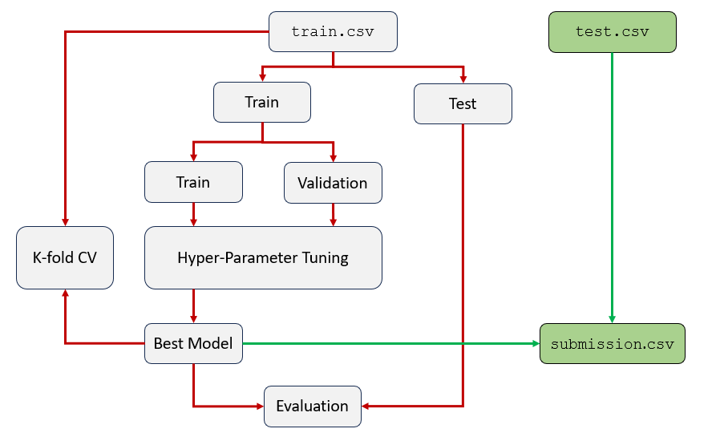
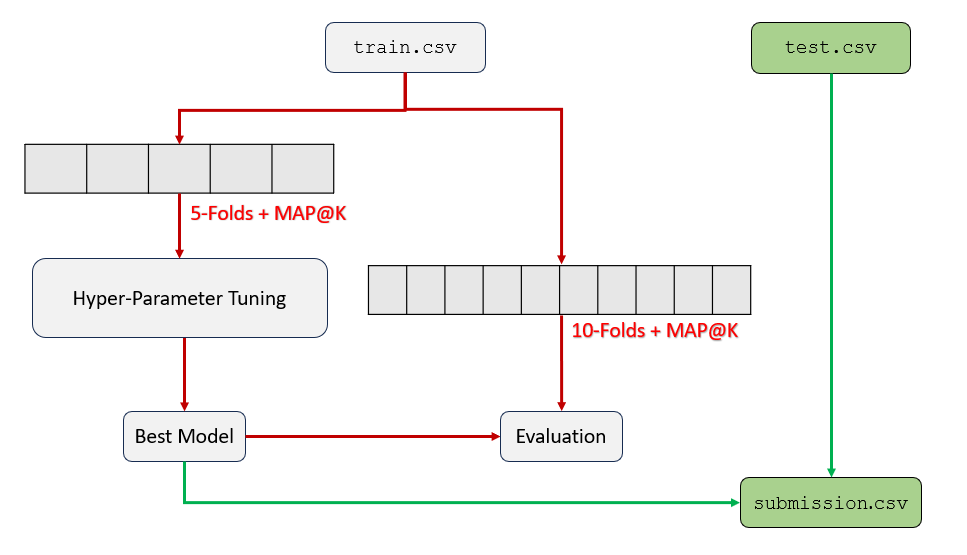
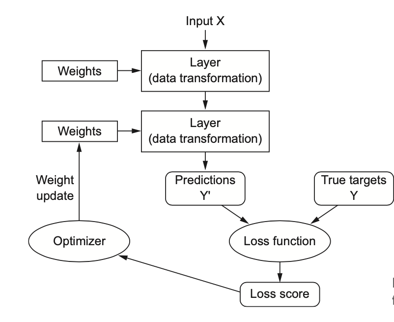

This repository contains a collection of Jupyter notebooks crafted as part of the Data-Driven Decision Making and Machine Learning/Artificial Intelligence (DDMO-ML-AI) course. These notebooks are designed to provide hands-on experience with core machine learning concepts, algorithms, and data analysis techniques.

Overview
The RandomForest.ipynb notebook is a highlight of this repository. It explores the Random Forest algorithm—a powerful and versatile ensemble learning method widely used for both classification and regression problems. This notebook walks through the entire pipeline of applying Random Forest, from data preparation to model evaluation and visualization.

Key Features of the Notebook
Data Preprocessing:

Handles missing values, encoding categorical features, and feature scaling to prepare data for modeling.
Discusses best practices to ensure data quality for machine learning tasks.
Model Training:

Demonstrates how to train a Random Forest classifier using real-world datasets.
Fine-tunes hyperparameters using GridSearchCV to achieve optimal model performance.
Model Evaluation:

Assesses the model's accuracy, precision, recall, and F1-score.
Visualizes the results using intuitive plots for better understanding.
Insights & Visualization:

Feature Importance Plot: Highlights the most impactful features in decision-making.

Confusion Matrix: Provides a visual representation of the model's predictions versus actual labels.

ROC Curve: Evaluates the model's performance across different thresholds.

System Architecture
This notebook is part of a larger project that involves data division and neural network training. The images below demonstrate the process used in the system:

Data Division:
This image illustrates how the data is split into training and test sets, ensuring that the model is trained on one portion and validated on another. This division is crucial for evaluating model generalization.

Data Division for Neural Networks:
For neural networks, the data is further divided into training, validation, and test sets. This ensures that the model can tune its weights effectively during training while being tested on unseen data for robust evaluation.

Backpropagation:
Backpropagation is a key method used in neural networks to optimize the weights of the model during training. This image illustrates the flow of gradients through the network to minimize the error function.

Getting Started
Follow these steps to get started with the notebook:

Clone the Repository:

bash
git clone https://github.com/MuhammadAliacc/Notebooks--DDMO-ML-AI.git  
Navigate to the Repository:

bash
cd Notebooks--DDMO-ML-AI  
Install Dependencies:
Ensure you have Python installed along with the required libraries:

numpy
pandas
scikit-learn
matplotlib
seaborn
Install them using:
bash
pip install numpy pandas scikit-learn matplotlib seaborn  
Run the Notebook:
Launch Jupyter Notebook and open RandomForest.ipynb:

bash
jupyter notebook  
Follow the instructions in the notebook to execute the cells step-by-step.

Objectives of the Project
The notebook is designed to:

Provide a hands-on approach to understanding Random Forests.
Showcase how to preprocess real-world data for machine learning.
Compare the performance of a Random Forest model with other algorithms.
Empower users to analyze and interpret model results effectively.
Explore the Repository
This repository complements your learning and experimentation in machine learning. Each notebook focuses on a specific topic, providing theoretical explanations alongside practical implementations.

Contributing
Contributions are welcome! If you have suggestions or enhancements, feel free to:

Fork the repository.
Create a new branch for your changes.
Submit a pull request with a detailed description of your improvements.

Repository Links
For the complete collection of notebooks, visit the repository here.
Related resources and documentation are provided in the notebook itself for further learning.
